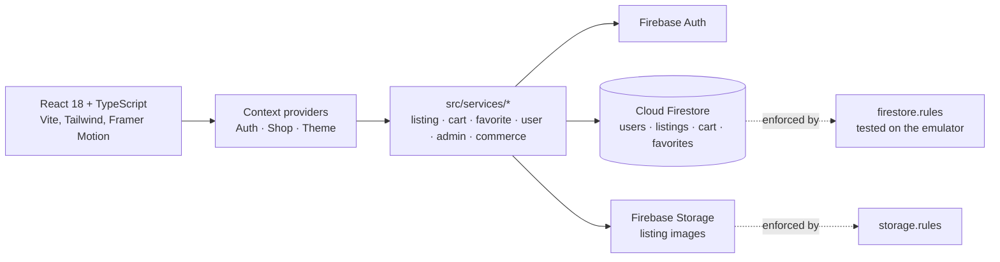

# DormDeals

A campus marketplace where students list, browse, favourite and buy or rent
items from other students on the same campus. React single-page app on
Firebase (Auth, Firestore, Storage, Hosting).

[](https://github.com/firegiant9000/DormDeals/actions/workflows/ci.yml)

**Live:** https://dormdeals-9cb29.web.app (deployed by CI from `main`)

> **Status:** four-person course project (Fall 2025, University of Louisiana at
> Lafayette) that reached a working MVP: auth, listings, search, cart,
> favourites, profiles and an admin view. Checkout and messaging are UI
> facades, there is no .edu verification, and there are no real users. Arlo
> Kharod added CI, Firestore rules hardening, observability and a solo
> continuation roadmap in June 2026 ([ROADMAP.md](ROADMAP.md)); that roadmap
> has not been executed.

<!-- Screenshots: none captured yet. Marketplace grid, listing detail,
     create-listing form and profile would be the four to add. -->

## Architecture

The browser talks to Firebase directly through a typed service layer; there
is no application server.



[ARCHITECTURE.md](ARCHITECTURE.md) covers the layering, data model, security
rules and trade-offs in detail. [docs/adr/ADR-002.md](docs/adr/ADR-002.md)
records the move from the original Express + SQL plan (ADR-001, superseded)
to Firebase; `api/`, `database/`, `render.yaml` and `Dockerfile` are leftovers
of that plan and are not used by the deployed app.

## Engineering notes

- **Access control lives in Firestore rules, and the rules are tested.**
  `firestore.rules` scopes users to their own profile, cart and favourites,
  gates listing writes to the owner or an admin, and denies collections that
  are not ready (`reviews`). `tests/firestore.rules.test.ts` runs against the
  Firestore emulator (`npm run test:rules`) and is a blocking CI step.
- **Components never call Firebase.** All reads and writes go through
  `src/services`, which map Firestore documents to TypeScript types.
- **CI gates the deploy.** Lint with zero warnings, `tsc`, Vitest unit tests,
  rules tests and a build must pass before the deploy job publishes hosting,
  rules and indexes to Firebase.
- **Observability is opt-in.** Sentry initialises only when a DSN is present;
  analytics events are inert without a measurement ID
  ([docs/analytics.md](docs/analytics.md)). Firestore read costs are tracked
  in [docs/firestore_costs.md](docs/firestore_costs.md).

## Tech stack

| Layer | Choice |
| --- | --- |
| UI | React 18, TypeScript, Vite, Tailwind CSS, Framer Motion, React Router |
| Backend | Firebase Authentication, Cloud Firestore, Firebase Storage |
| Hosting | Firebase Hosting via GitHub Actions |
| Tests | Vitest + Testing Library, Firestore emulator rules tests, Playwright e2e |
| Observability | Sentry (optional), Firebase Analytics (optional) |

## Running it locally

Needs Node 20, a Firebase project (free tier) with Email/Password auth and
Firestore enabled, and a JRE for the rules emulator.

```bash
git clone https://github.com/firegiant9000/DormDeals.git
cd DormDeals
npm ci
cp env.example .env        # paste your Firebase web config
npm run dev                # http://localhost:5173
```

[docs/FIREBASE_SETUP.md](docs/FIREBASE_SETUP.md) walks through creating the
project. Deploying your own copy is `firebase deploy` with the same config;
the CI workflow shows the exact commands.

## Tests

```bash
npm run lint && npm run type-check
npm test                   # Vitest unit and component tests
npm run test:rules         # Firestore rules on the emulator
npm run test:e2e           # Playwright (needs the dev server)
```

28 unit/component test files and 12 Playwright specs are in the tree. The
Playwright report and results directories are generated and gitignored.

## Team and contributions

Built by four students: **Arlo Kharod** (tech lead), **Clarence Chong**
(feature developer), **Hans Trosclair** (QA and documentation), **Olivia
Deshotel** (UI/UX design). The GitHub repository mirrors the original GitLab
course repository.

By `git log` on `main`, Clarence Chong wrote the largest share of the
application code (most of `src/`, the Firebase migration and service layer,
and the original Express/SQL backend). Arlo Kharod wrote about a third of
`src/`, and owns the Firestore security rules, the rules test suite, the
GitHub Actions CI and deploy pipeline, Sentry and analytics wiring, and the
June 2026 roadmap and cost/audit docs. Hans Trosclair wrote the admin
features, navigation and routing, authentication e2e tests and the Phase 3
test documentation. Olivia Deshotel wrote component unit tests and page e2e
tests alongside the UI design. `ARCHITECTURE.md` was written mainly by
Clarence and Hans.

## License

No license file is present, so the code is all rights reserved by its four
authors. Adding one needs their agreement.
