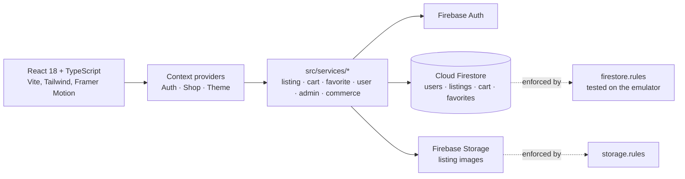

# DormDeals

A campus marketplace where students list, browse, favourite and buy or rent
items from other students on the same campus. React single-page app on
Firebase (Auth, Firestore, Storage, Hosting).

[](https://github.com/firegiant9000/DormDeals/actions/workflows/ci.yml)

> **Status: completed team project, archived.** Built by four students for a
> Fall 2025 course at the University of Louisiana at Lafayette. It reached a
> working MVP: auth, listings, search, cart, favourites, profiles and an admin
> view. Checkout and messaging are UI facades, there is no .edu verification,
> and there are no real users. In June and September 2026 Arlo Kharod added CI,
> Firestore rules hardening with emulator tests, and observability. A solo
> continuation roadmap was drafted and then cancelled
> ([ROADMAP.md](ROADMAP.md)). The project is not under development.

**Demo:** https://dormdeals-9cb29.web.app is the course-era build, deployed
in December 2025. It predates the 2026 rules and CI work in this repository.
The GitHub deploy job skips until repository secrets are configured. Checkout
is a facade: nothing is charged or sent.

<!-- Screenshots: none captured yet. Marketplace grid, listing detail,
     create-listing form and profile would be the four to add. -->

## Architecture

The browser talks to Firebase directly through a typed service layer; there
is no application server.



[ARCHITECTURE.md](ARCHITECTURE.md) covers the layering, data model, security
rules and trade-offs in detail. [docs/adr/ADR-002.md](docs/adr/ADR-002.md)
records the move from the original Express + SQL plan (ADR-001, superseded)
to Firebase. The Express server, SQL schema and Render config from that plan
were removed in September 2026; the app has no server of its own.

## Technical highlights

- **Access control lives in Firestore rules, and the rules are tested.**
  Users are scoped to their own profile, cart and favourites. Listing writes
  are owner-only. Collections that were never built (`reviews`,
  `conversations`, `reports`, `transactions`, `auditLog`) are denied outright.
  `tests/firestore.rules.test.ts` runs 27 cases against the Firestore emulator
  (`npm run test:rules`) and is a blocking CI step.
- **Field allowlists and server time.** A listing create must match an exact
  key set (`keys().hasOnly`) and pin `createdAt` to `request.time`. Updates
  are limited by `affectedKeys()`. `ownerId` and `createdAt` are immutable.
  Non-owners may only increment `views` by exactly one.
- **No self-granted privilege.** Admin status is a document in `admins/{uid}`
  that no client can write, not a flag on the user's own profile. A user
  cannot change their own `userType`, ban status, verification flag or
  reputation counters.
- **CI gates the deploy.** Lint with zero warnings, `tsc`, Vitest unit tests,
  rules tests and a production build must all pass before the deploy job runs.
  The deploy job checks for its secrets first and skips with a notice instead
  of failing.
- **Observability is opt-in.** Sentry initialises only when a DSN is present,
  and analytics events are inert without a measurement ID
  ([docs/analytics.md](docs/analytics.md)). Firestore read costs are tracked
  in [docs/firestore_costs.md](docs/firestore_costs.md).
- **Components never call Firebase.** All reads and writes go through
  `src/services`, which map Firestore documents to TypeScript types.

## Tech stack

| Layer | Choice |
| --- | --- |
| UI | React 18, TypeScript, Vite, Tailwind CSS, Framer Motion, React Router |
| Backend | Firebase Authentication, Cloud Firestore, Firebase Storage |
| Hosting | Firebase Hosting via GitHub Actions |
| Tests | Vitest + Testing Library, Firestore emulator rules tests, Playwright e2e |
| Observability | Sentry (optional), Firebase Analytics (optional) |

## Running it locally

Needs Node 20, a Firebase project (free tier) with Email/Password auth and
Firestore enabled, and a JRE for the rules emulator.

```bash
git clone https://github.com/firegiant9000/DormDeals.git
cd DormDeals
npm ci
cp .env.example .env        # paste your Firebase web config
npm run dev                # http://localhost:5173
```

[docs/FIREBASE_SETUP.md](docs/FIREBASE_SETUP.md) walks through creating the
project. Deploying your own copy is `firebase deploy` with the same config;
the CI workflow shows the exact commands.

## Tests

```bash
npm run lint && npm run type-check
npm test                   # Vitest unit and component tests
npm run test:rules         # Firestore rules on the emulator
npm run test:e2e           # Playwright (needs the dev server)
```

The tree has 15 unit/component test files, the emulator rules suite, and 12
Playwright specs. CI runs the unit and rules tests. The Playwright specs run
locally only. The Playwright report and results directories are generated
and gitignored.

## Team

Built by four students: **Arlo Kharod** (tech lead), **Clarence Chong**
(feature developer), **Hans Trosclair** (QA and documentation) and **Olivia
Deshotel** (UI/UX design). The GitHub repository mirrors the original GitLab
course repository, and `.gitlab-ci.yml` is that course pipeline, kept for
reference.

By `git log`, Clarence Chong wrote the largest share of the application code:
most of `src/`, the Firebase migration and service layer, the original
Express/SQL backend, and much of `ARCHITECTURE.md`. Hans Trosclair wrote
access control, navigation and routing, the authentication e2e tests and the
Phase 3 test documentation. Olivia Deshotel wrote component unit tests and
page e2e tests alongside the UI design.

## My contributions (Arlo Kharod)

- **Tech lead during the course.** I contributed pages and contexts in
  `src/` and added the first Firebase config, rules and indexes
  (November–December 2025).
- **Security rules and their tests (2026).** I wrote the hardened
  `firestore.rules`, the admin registry and the emulator suite in
  `tests/firestore.rules.test.ts`.
- **CI/CD.** I wrote `.github/workflows/ci.yml` with its lint, type-check,
  unit, rules and build gates, and the deploy job with a secrets guard.
- **Observability and cost.** Sentry, the error boundary, analytics, the
  Firestore cost dashboard, and the index and cost audits in `docs/`.
- **Post-course maintenance.** The README and ADR corrections, removing the
  dead Express/SQL/Render code, the license, Dependabot, and this archive pass.

I did not write most of the marketplace UI or the service layer. Those were
Clarence's.

## Deploying

When its repository secrets are set, CI deploys `main` to Firebase Hosting,
along with Firestore rules and indexes. Without them the deploy job skips with
a notice, which is the current state; see
[.github/workflows/ci.yml](.github/workflows/ci.yml). To deploy your own
copy, run `npm run build:production` and then `firebase deploy` against your
project.

## License

[MIT](LICENSE).
